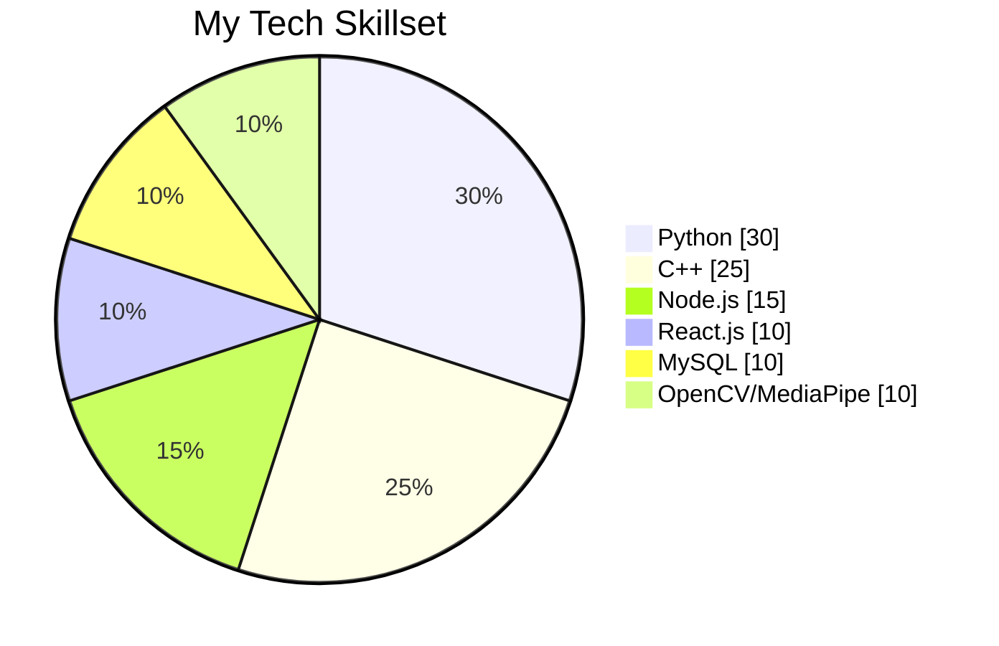

<h1 align="center">Hi 👋, I'm Harsh Choudhary</h1>
<h3 align="center">💻 Computer Science Undergrad | Python & C++ Dev | Hackathon Explorer 🚀</h3>

---

### 🧠 About Me

- 🎓 B.Tech in Computer Science @ ABESIT, Ghaziabad (2024–2028)  
- 💡 Exploring AI, Web Development, and Real-world Projects  
- ⚙️ Participated in HackWithMAIT, CodeHunt, IEEE BVCOE, and more  
- 🎹 Piano enthusiast and cultural event contributor  
- 🧠 Focused on building practical, scalable tech solutions  

---

### 🛠️ Tech Skills

---

### 🧰 Languages & Tools

  

---

### 📊 GitHub Stats & Activity

  
  

--- 

### 🏆 GitHub Trophies

  

---

### 📫 Connect with Me

- 🌐 [LinkedIn](https://www.linkedin.com/in/harsh-choudhary-88787311/)  
- 💻 [GitHub](https://github.com/Harsh-Choudhary-21)

---

> _"Code is not just what you write, it's what you leave behind."_ 🧠
